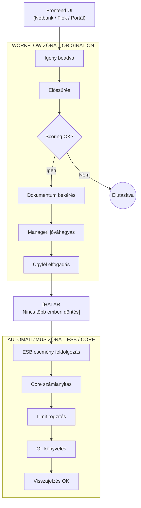
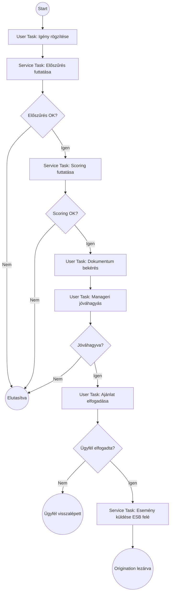

### Workflow vagy Automatizmus (MBH szemmel)
#### Frontend‑es ORIGINATION‑ben: mindkettő van, de NEM ugyanarra valók.<br>
#### Workflow az originationben, automatizmus az ESB/core oldalon.<br>
👉 Workflow = üzleti folyamat, állapotokkal és emberi döntési pontokkal<br>
Jellemzői:
 - lépései vannak (state machine)
 - lehet benne:
     - user input
     - jóváhagyás
     - várakozás
     - visszalépés
 - nem determinisztikus
 - UX‑hez kötődik

ORIGINATION-ben tipikusan:
 - igény rögzítve
 - dokumentumhiány
 - scoring lefut
 - elutasítva / feltételesen elfogadva
 - manageri override
 - ügyfél visszalép
 - ajánlat elfogadás<br>
👉 Ez klasszikus workflow, nem automatizmus.<br>

#### Automatizmus = determinisztikus, szabályvezérelt, ember nélküli lépés
Jellemzői:
 - trigger → fix eredmény
 - nincs „állapota”, csak lefut
 - nem kérdez vissza
 - technikai szemléletű

Tipikusan:
 - napzárás elindul
 - scoring engine lefut
 - adatok átmennek ESB-n
 - könyvelés megtörténik<br>
👉 Ez nem workflow, hanem automatizmus.

#### ✅ ORIGINATION-ben Workflow kell
Mert az origination:
 - ügyfél‑vezérelt
 - nem lineáris
 - visszaléphető
 - emberi döntéseket tartalmaz

Példa (frontend):
```
Igény beadva
   ↓
Előszűrés
   ↓
(score OK?)
   ├─ NEM → elutasítás
   └─ IGEN
        ↓
Dokumentum feltöltés
        ↓
Manageri jóváhagyás
        ↓
Ajánlat elfogadva
```

#### ✅ ESB / Core oldalon jön az automatizmus
Amikor:
 - az origination lezárult
 - megszületett a döntés
 - nincs több üzleti vita

Példa (automatizmus):
```
Esemény: "Ügylet elfogadva"
→ ESB meghívja a core szolgáltatást
→ számla létrejön
→ limit rögzül
→ GL könyvel
→ visszajelzés
```

#### 👉 MBH‑s „aranyszabály”
```
Ahol ember gondolkodik: workflow
Ahol rendszer végrehajt: automatizmus

Az MBH frontend‑es origination folyamata workflow‑vezérelt, míg az ESB‑n és a core rendszereken túl már kizárólag automatizmus fut
(ez biztosítja az üzleti rugalmasságot és a prudenciális kontrollt egyszerre).
```

#### ✅ Rövid döntési táblázat
```
Ha ez a helyzet…             → Akkor
Emberi döntések vannak       → Workflow engine
Ügyfél lép be                → Workflow
Állapotok hetekig élnek      → Workflow
„Ha–akkor–különben” emberrel → Workflow
Determinisztikus végrehajtás → Automatizmus
```

#### 👉 Workflow vs. Automatizmus (MBH‑s határ) példa:
```
                ┌──────────────────────────┐
                │        FRONTEND UI        │
                │  (Netbank, Fiók, Portál)  │
                └─────────────┬────────────┘
                              │
                              ▼
────────────────────────────────────────────────
        WORKFLOW ZÓNA – ORIGINATION
        (üzleti folyamat, emberi lépések)
────────────────────────────────────────────────
                              │
    ┌───────────────┐   ┌───────────────┐
    │  Igény beadva │→→ │ Előszűrés     │
    └───────────────┘   └───────────────┘
             │                  │
             ▼                  ▼
    ┌───────────────┐   ┌───────────────┐
    │ Dokumentum    │   │ Scoring OK?   │
    │ bekérés       │   ├─────┬─────────┤
    └───────────────┘   │ IGEN │  NEM    │
             │          ▼      ▼
             │     Ajánlat   Elutasítás
             ▼
     Manageri jóváhagyás
             │
             ▼
       Ügyfél elfogadta
             │
             ▼
─────────────│──────────────────────────────────
             │   HATÁR – NINCS TÖBB EMBER
─────────────│──────────────────────────────────
             ▼
────────────────────────────────────────────────
        AUTOMATIZMUS ZÓNA – ESB / CORE
        (determinista, auditált végrehajtás)
────────────────────────────────────────────────
             │
             ▼
     ESB esemény: "Deal Accepted"
             │
             ▼
   Core banking számlanyitás
             │
             ▼
      Limit beállítás
             │
             ▼
        GL könyvelés
             │
             ▼
       Visszajelzés OK
```
#### 🧠 Ábra üzenete
 - Workflow fent: rugalmas, emberi, nem lineáris
 - Automatizmus lent: szigorú, reprodukálható
 - ESB = határőr, nem üzleti folyamatgazda

vagy



#### 🧠 Értelmezés:
##### ✅ Workflow zóna
 - BPMN / workflow engine
 - emberi döntések
 - visszalépés, várakozás
 - UX‑vezérelt
##### ✅ Automatizmus zóna
 - ESB
 - determinisztikus
 - prudenciális
 - auditálható
 - nincs hosszú életű állapot

Röviden:
 - Az origination frontend oldalon workflow‑val kezelendő, mert ott emberi döntések és állapotok vannak →
 - amint az ügylet elfogadott, az ESB‑n túl már csak automatizmus futhat.

### Frontend ORIGINATION (BPMN) jellegű workflow (Mermaid-ban)

#### 🧠 Ábra magyarázata:
 - User Task ↔ emberi lépés
 - Service Task ↔ automatizmus
 - Exclusive Gateway ↔ döntési pont
 - ESB esemény küldése = workflow vége
